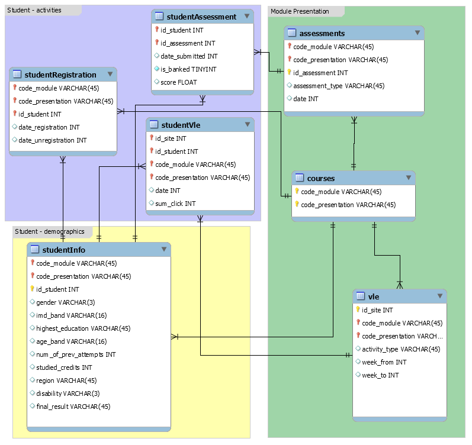

# Student Succes Analysis in an Online Learning Environment

This work is an analysis of the student's success in an online learning environment. Reveal the underlying behaviours and provide an understanding for participants (students, teachers or platform providers) of these environments.

The data is Open University Learning Analytics Dataset. Kuzilek, J., Hlosta, M., & Zdrahal, Z. [https://doi.org/10.6084/m9.figshare.5081998.v1](https://doi.org/10.6084/m9.figshare.5081998.v1) (2017). It consists of seven courses for two semesters of 2013 and 2014. Raw data is a set of seven tables.

The modelling response has four different subjects 'Distinction', 'Pass', 'Fail' and 'Withdrawn'. For that reason, the approach is a multi-class supervised classification. Since the distinction has much fewer members, it causes the data to be imbalanced and caused the problem to be more challenging for the model.

On [exploratory data analysis](./jupyter_notebooks/2_Exploratory_Data_Analysis.ipynb), some students have the same mean scores, but end with different final results showed that the scores are not the only determiner for the final result. Besides, some students had one as their first score but ended up with distinction. Also, the mean score spread shows that there is a huge overlap of withdrawn and pass. These two are big signs for staying on track can easily lead to success.

Statistical tests show that the region, age or [indices of multiple deprivations](https://en.wikipedia.org/wiki/Multiple_deprivation_index) does not affect the final result and feature importances will confirm.

Data has some unuseful features along with some missing information on useful features. While unuseful features dropped, missing information either imputed or the related rows dropped. Details are in the [feature engineering notebook](/jupyter_notebooks/3_Feature_Engineering.ipynb).

Preprocessed data have 32546 rows and 25 columns. Although, some of these columns have either ordinal or nominal data. They are encoded accordingly, and the final table consists of 56 columns. Seven out-of-box models trained and tested.

Even though Random Forest overfits the training data it scored better on the test split. Additionally, Gradient Boost had the second-best results.

Scores on the test split:

. | Random Forest | Gradient Boost
------|------|------
Accuracy | 0.709352 | 0.705051
MCC |  0.58345 | 0.577303

Reasons for deciding these metrics are:

- Accuracy is easily interpretable with anyone
- Mathew's-correlation-coefficient is a good option for scoring models with imbalanced data

Detailed information for MCC can be found [here](https://www.kdnuggets.com/2018/06/right-metric-evaluating-machine-learning-models-2.html) and [here](https://en.wikipedia.org/wiki/Matthews_correlation_coefficient#Advantages_of_MCC_over_accuracy_and_F1_score).

These two models tuned with [Bayesian Optimization](https://github.com/fmfn/BayesianOptimization). Even though they both do not show any considerable improvement and both revealed some critical feature importances

Both models had similar top and bottom feature importances. While score features are being the most important ones both models gave credit homepage clicks. This is valuable because it is neither the most visited page nor the most clicked one.

>["For it is said in proverbs that the beginning is half of every work"](
https://latin.stackexchange.com/questions/12900/is-the-beginning-is-half-of-every-action-truly-a-greek-proverb)

It also revealed that the least important features were age, disability and gender.

In conclusion, seven out-of-box models having similar scores and even after the smart hyperparameter tuning does not end with significant difference shows that data needs more exploration and maybe develop more features.
